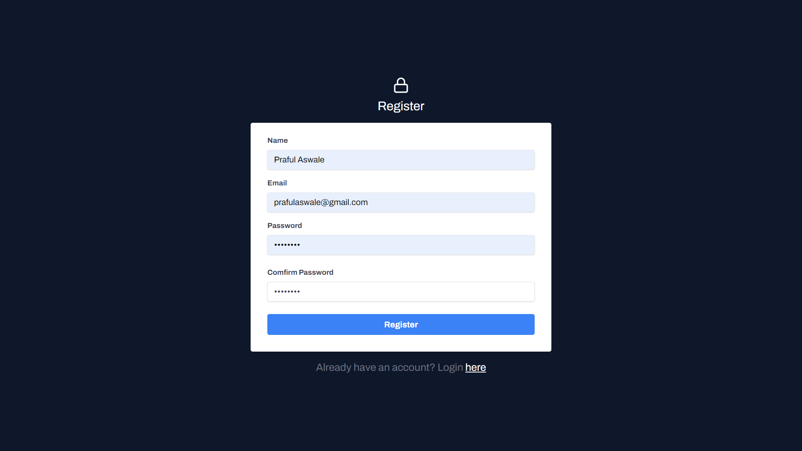
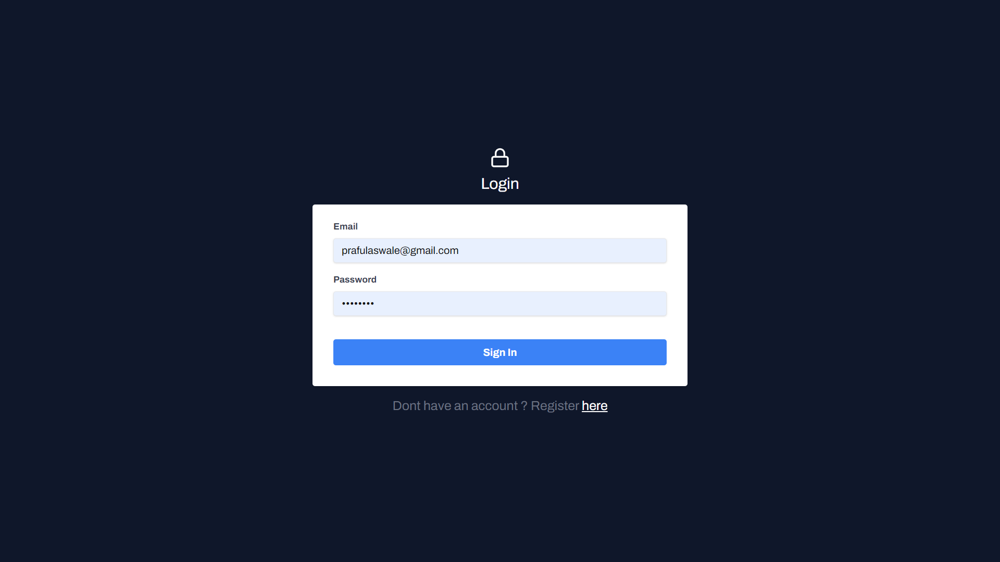
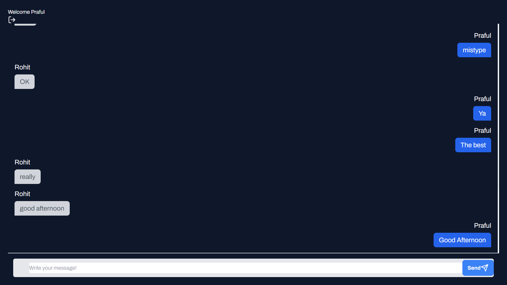

# Real Time Chat App With React JS, Node Js and Appwrite

A chat app with real-time capabilities that utilizes Appwrite on the backend. 
* [Chat App](https://chitchatreact18.netlify.app/).





### Getting Started
Clone the Git Repo
After cloning the repo ensure you complete the necessary installations

```
$ npm install
$ npm run dev
```

Create a new `.env` file and paste all values in that file with respected IDs;

```js
//.env
...
VITE_APPWRITE_URL="https://YOUR_ENDPOINT"
VITE_APPWRITE_PROJECT_ID="PROJECT_ID"
VITE_APPWRITE_DATABASE_ID="DATABASE_ID"
VITE_APPWRITE_COLLECTION_ID="COLLECTION_ID"     
...
```

**Setting Up Appwrite Account**

Set up a local instance of Appwrite or create an account with Appwrite Cloud.

In your appwrite console create a project and database.

1. Create a collection called "messages" and add the following attributes:
    - user_id
    - username
    - body
2. From your `messages` collection, go to the "settings" --> "Update Permissions" --> "+ Add Role" and select "Users". Give this user type "Create", "Read", "Update" and "Delete" permissions.

Once you've set up your project you should be able to update all necessary env variables. 
Run your development server to view the output.